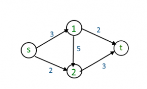
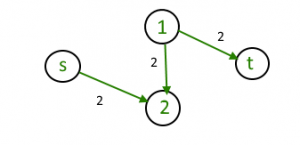
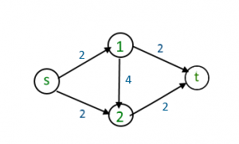
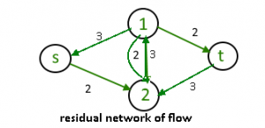

# Ford-Fulkerson For Maximum Flow
The Ford-Fulkerson algorithm to find the maximum flow of a flow graph is essentially an improved version of the naive approach.

### Naive Approach
The naive approach is very simple. Imagine the below flow graph:

To find maximum flow, start at the source node, labelled `s`, and use a greedy approach to traverse the next node with the highest possible flow. In this case, you would traverse from `s` to `1` as it has a higher flow than from `s` to `2`. Then, from `1`, repeat the process, traversing to the highest flow node `2`, until we eventually reach the sink node `t`.

In this approach, we would find a path of `[s, 1, 2, t]` that allows for a maximum flow of 3. However, we can improve on this approach by introducing the concept of a residual graph.

### Residual Graph
If we modify the above flow graph to account for the path that have just found, it would look like this:

For every edge that was used, we have subtracted the flow that the edge will use from its capacity. In this case, we have subtracted 3 from the edges `[s, 1]`,`[1, 2]`,`[2, t]`. For edges `[s, 1]` and `[2, t]`, this meant that its remaining capacity was 0, and we can remove them from the graph to simplify.

### Ford-Fulkerson

Ford-Fulkerson utilizes this residual graph, and essentially directs 2 units of flow backwards from `[2, 1]` to form another path. But wait, how does that work? I thought these flow graphs are directed?

You would be right, if this was a system of pipes, then it would be physically impossible for water to be flowing both ways. However, if we change how we think about this reverse flow, it becomes possible.

Instead of actually having reverse flow on edge `[2, 1]`, imagine it as a request to reduce existing flow on that edge by 2. For the existing path found by the naive algorithm, reduce flow by 2, so that it only uses 1 unit of flow along the path `[s, 1, 2, t]`:

Given this flow graph, it's easy to see how maximum flow is 4, simply having 2 units flowing from the top path and 2 from the bottom, and if you add the new flow of the initial path, 1, we get a total maximum flow of 5.

The actual implementation does not quick work like this, and does treat it like reverse flow in the code. Instead, every time an edge is chosen to be used as the path for maximum flow, a reverse edge is built that has the capacity of the flow that was used. Recall that our original naive algorithm found a path of flow 3 consisting of `[s, 1, 2, t]`, leading to the residual graph of:

If we built reverse edges as we built that path, we have the flow graph with reverse edges of: 

Notice the reverse edges that form a path of capacity 3 from `[t, 2, 1, s]`. The building of these reverse edges allows the naive algorithm to effectively have "undo" operations, but to me, that is not very intuitive. So instead I choose to have the "request to reduce flow" explanation that I personally find more intuitive.